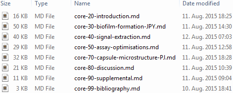
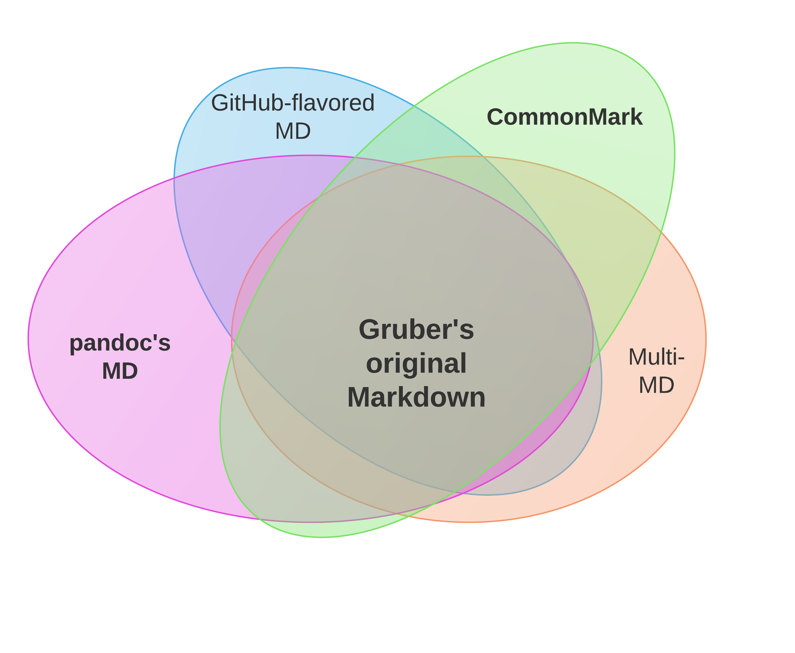

# This is not a scientific talk, but an introduction to a modern way of writing.

<!--
http://www.chembiol.uni-konstanz.de/statement.html says "training programs that transcend traditional disciplines"
Me, and the organisers apparently as well, believe it is relevant to many aspects of science
-->

### Any new way of writing may touch many aspects of science

\begin{center}
    \smartdiagram[bubble diagram]{
        SCIENCE,
            review\\literature,
            formulate\\hypotheses,
            prepare\\lectures,
            publish\\findings,
            analyse\\data,
            document\\observations,
            conduct\\experiments
        }
\end{center}

> [...] a plain text formatting syntax [...] intended to be as easy-to-read and easy-to-write as is feasible.
> 
> -- John Gruber and Aaron Swartz (2004)[^1]

# Markdown is one such modern way of writing.

[^1]: [daringfireball.net/projects/markdown](https://daringfireball.net/projects/markdown/syntax)
[^at]: [alternativeto.net/tag/text-substitution](https://alternativeto.net/tag/text-substitution/)

### What is Markdown? Plain text.

> - small files load, save & sync faster
> - large choice of editors & related software tools

### What is Markdown? Markup language.

- Humanities going digitally faster than natural sciences?
\begin{center}
    \smartdiagram[sequence diagram]{
        unformatted text,
        markup / formatting,
        presentable document
        }
\end{center}

> - separate content from display style ("marking up")
> - but intermix markup tags/commands with text
> - `.docx`, `.odt`, etc. also XML-based

<!--
all modern document formats are markup
choice is: control the markup, or let the software control it?
Markdown lets you control it.
-->

### What is Markdown? Markup language.

\               | \LaTeX\                      | HTML                 
---------------:|----------------------------- |----------------------
**bold**        | `\textbf{bold}`              | `<b>bold</b>`        
*Species name*  | `\textit{Species name}`      | `<i>Species name</i>`
**Heading 1**   | `\section{Heading 1}`        | `<h1>Heading 1</h1>`
Heading 2       | `\subsection{Heading 2}`     | `<h2>Heading 2</h2>`
~~strike out~~  | `\sout{strike out}`          | `<strike>out</strike>`

### What is Markdown? Minimalistic formatting syntax.

\               | Markdown              
---------------:|-----------------
**bold**        | `**bold**`      
*Species name*  | `*Species name*`
**Heading 1**   | `# Heading 1`   
Heading 2       | `## Heading 2`  
~~strike out~~  | `~~strike out~~`

> - short commands = easier typing & reading
> - tried & tested through decades of Internet communication
> - interoperable across many editors & online services
> - basis for powerful automation & conversion options

<!--
evolutionary time spans on Internet
-->

### Words of caution: Different dialects/flavors

> - similar to \LaTeX\ templates, classes & styles
> - any is fine for simple document

### Enables Open Science
### Some software tools with Markdown support

<!--
not something I have developed
just passing along the message
-->

> - [\ Sublime Text](https://www.sublimetext.com/) 
> - [Jens Erat's Scientific Markdown](https://github.com/JensErat/scientific-markdown) & [John MacFarlane's pandoc by ](http://pandoc.org/index.html) provide scientific writing environment (citations, figures, tables, bibliographies, formulas, etc.)

#### [\ Authorea.com](https://authorea.com/)

> - collaborative manuscript preparation platform (also for \LaTeX)
> - integrates Mendeley, EndNote & Zotero

#### [\ PeerJ Paper Now](https://github.com/PeerJ/paper-now)

> - template for MD-formatted scientific texts & figures
> - generates & publishes article website[^PN]

[^PN]: [katrinleinweber.github.io/paper-now](https://katrinleinweber.github.io/paper-now/)

### Write in Word
# Markdown use-case examples

- exponentially increasing learning curve
- [Writage add-in ](http://www.writage.com/) 

### Words of caution: try with finished doc, or small new one!

> - initially steep learning curve:
>     - memorising MD syntax
>     - set-up of text editor, automations & other tools
> - but getting easier with time, regardless of document size

\begin{figure}
  \centering
  \includegraphics[width=4cm]{images/dont-change-horses-in-middle-of-river.png}
  \caption{\href{http://www.ishestar.is/}{Íshestar} via \href{http://www.equitrekking.com/articles/entry/iceland_horseback_riding_vacation_photo_journey/}{equitrekking.com}}
\end{figure}

### Digital lab journalling

### Experiment summaries

](images/rmarkdown.jpg)

### Better document versioning than this:

### Plain text version control with Git:

](images/file-changes-in-GitHub.png)

### *Write in Word?* Save in Markdown! Publish in \LaTeX!

> - [Writage.com](http://www.writage.com/) adds Markdown support into MS Word
> - produces more command symbols than necessary
> - renames media files & looses figure captions :-/

<!--suboptimal => go the whole way to writing Markdown yourself-->

# Write in Word, \newline Save in Markdown, \newline Publish in \LaTeX

# ~~Write in Word~~, \newline Write & Save in Markdown, \newline Publish in \LaTeX

### Thanks for your attention! Questions?

- katrin.leinweber@uni.kn
- Markdown questions on [\ StackOverflow.com](https://stackoverflow.com/questions/tagged/markdown)
- live demo: [commonmark.org/dingus](http://spec.commonmark.org/dingus/)
- more syntax: [guides.github.com/features/mastering-markdown](https://guides.github.com/features/mastering-markdown/#examples)
- recording will appear on [konscience.de/md](http://www.konscience.de/md) soon

##### Acknowledgements

- Ralf, Sarah, Sina, Xiaohui, and all other retreat organisers
- [Scientific Markdown by Jens Erat](https://github.com/JensErat/scientific-markdown)

