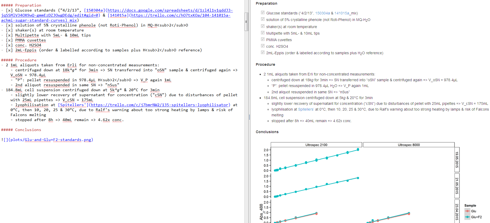

# This is not a scientific talk, but an introduction to a modern way of writing.

<!--
http://www.chembiol.uni-konstanz.de/statement.html says "training programs that transcend traditional disciplines"
Me, and the organisers apparently as well, believe it is relevant to many aspects of science
-->

### Any new way of writing may touch many aspects of science

\begin{center}
    \smartdiagram[bubble diagram]{
        SCIENTIFIC\\WRITING,
            brainstorming\\ideas,
            reviewing\\literature,
            preparing\\lectures,
            preparing\\publications,
            analysing\\data,
            documenting\\experiments,
            taking\\notes
        }
\end{center}

<!--
Who uses Word, Markdown & LaTeX?
Who likes \LaTeX?
Who knows Markdown?
-->

# Markdown is one such modern way of writing.

### What is Markdown? Markup language.

\begin{center}
    \smartdiagram[sequence diagram]{
        text \& figures,
        add markup,
        format / compile,
        document
        }
\end{center}

> - all modern document formats are markup
> - Word processors just hide it & compile in real-time
> - languages differ in ratio of text to syntax

<!--
> - \LaTeX\, HTML but intermix markup tags/commands with text
> - `.docx`, `.odt`, etc. also XML-based

choice is: control the markup, or let the software control it?
Markdown lets you control it.
-->

### What is Markdown? Markup language.

\               | \LaTeX\                      | HTML                 
---------------:|----------------------------- |------------------------
**bold**        | `\textbf{bold}`              | `<strong>bold</strong>`
*Species name*  | `\emph{Species name}`        | `<i>Species name</i>`  
**Heading 1**   | `\section{Heading 1}`        | `<h1>Heading 1</h1>`   
Heading 2       | `\subsection{Heading 2}`     | `<h2>Heading 2</h2>`   
~~strike out~~  | `\sout{strike out}`          | `<strike>out</strike>`
H~2~O           | `H\textsubscript{2}O`        | `H2O`
Ca^2+^          | `Ca\textsuperscript{2+}`     | `Ca2+`

> - only readable in compiled form (PDF, website)
> - classes & style files determine compiled look
> - editing those requires deeper knowledge of the language

### What is Markdown? Plain text, formatting syntax.

\               | Markdown              
---------------:|-----------------
**bold**        | `**bold**`
*Species name*  | `*Species name*`
**Heading 1**   | `# Heading 1`   
Heading 2       | `## Heading 2`  
~~strike out~~  | `~~strike out~~`

<!--
evolutionary time spans on Internet
> - interoperable across many editors & online services
-->

H_2_O           | `H~2~O`
Ca^2+^          | `Ca^2+^`

> - defined in 2004 by John Gruber[^df] & Aaron Swartz
> - based on email conventions, built for web publishing
> - has links, images, tables, footnotes, quotes and more[^syntax]
> - minimalistic, easy to type & read, interoperable
> - accepts lazy users & works around them

[^df]: [daringfireball.net/projects/markdown](https://daringfireball.net/projects/markdown/syntax)
[^syntax]: [guides.github.com/features/mastering-markdown](https://guides.github.com/features/mastering-markdown/#examples)

# Markdown use-case examples

### Digital lab journalling

### Experiment summaries

](images/rmarkdown.jpg)

### Better document versioning than this:

### Plain text version control with Git:

](images/file-changes-in-GitHub.png)

### Words of caution: try with finished doc, or small new one!

> - initial time invest to learn syntax & install tools
> - pays off later, esp. for large documents

> - different variants have slightly different capabilities
> - way back to MS Word is always possible

\begin{figure}
  \centering
  \includegraphics[width=4cm]{images/dont-change-horses-in-middle-of-river.png}
  \caption{\href{http://www.ishestar.is/}{Íshestar} via \href{http://www.equitrekking.com/articles/entry/iceland_horseback_riding_vacation_photo_journey/}{equitrekking.com}}
\end{figure}

### Some software tools with Markdown support

<!--
not something I have developed
just passing along the message
-->

> - editors with live preview: [\ MarkdownPad](https://markdownpad.com/) & [\ MacDown](http://macdown.uranusjr.com/)

#### [\ Authorea.com](https://authorea.com/)

> - collaborative manuscript preparation platform (also for \LaTeX)
> - integrates Mendeley, EndNote & Zotero
> - 1-click-formatting & submission available for several journals 

#### [\ PeerJ Paper Now](https://github.com/PeerJ/paper-now)

> - GitHub template for MD-formatted scientific texts & figures
> - generates & publishes article website[^PN]
> - no submission options (yet)

# All of the above: easier collaboration & publication 
[^PN]: [read-lab-confederation.github.io/nyc-subway-anthrax-study](https://read-lab-confederation.github.io/nyc-subway-anthrax-study/)

### *Write in Word?* Save in Markdown! Publish in \LaTeX!

> - [Writage.com](http://www.writage.com/) adds Markdown support into MS Word
> - produces more command symbols than necessary
> - renames media files & looses figure captions :-/

# Write in Word, \newline Save in Markdown, \newline Publish in \LaTeX

# ~~Write in Word~~, \newline Write & Save in Markdown, \newline Publish in \LaTeX (or Word)

### Summary: easier collaboration & publication 

##### Make a wish!

> - simple formatting rules, templates from publishers
> - version control & syncing instead of e-mailing files

##### In reality:

> - exploding in software development & web publishing
> - gaining traction in humanities
> - usable in natural sciences

### Thanks for your attention! Questions?

- Markdown questions on [\ StackOverflow.com](https://stackoverflow.com/questions/tagged/markdown)- live demo: [commonmark.org/dingus](http://spec.commonmark.org/dingus/)
- recording will appear on [konscience.de/md](http://www.konscience.de/md) soon

##### Acknowledgements

- Ralf, Sarah, Sina, Xiaohui, and all other retreat organisers
- [Scientific Markdown by Jens Erat](https://github.com/JensErat/scientific-markdown)
- [pandoc by John MacFarlane](http://pandoc.org/index.html)

